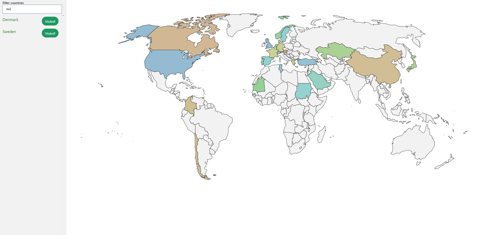

# Ding the world! 🌍

This is an interactive scratch map built with [Vue](http://vuejs.org), [VueX](https://github.com/vuejs/vuex/), and [VueXPersistedState](https://github.com/robinvdvleuten/vuex-persistedstate)!

The map is from [SimpleMaps](https://simplemaps.com/resources/svg-world).

## License

Sindre Bøyum (2019-2023), MIT
